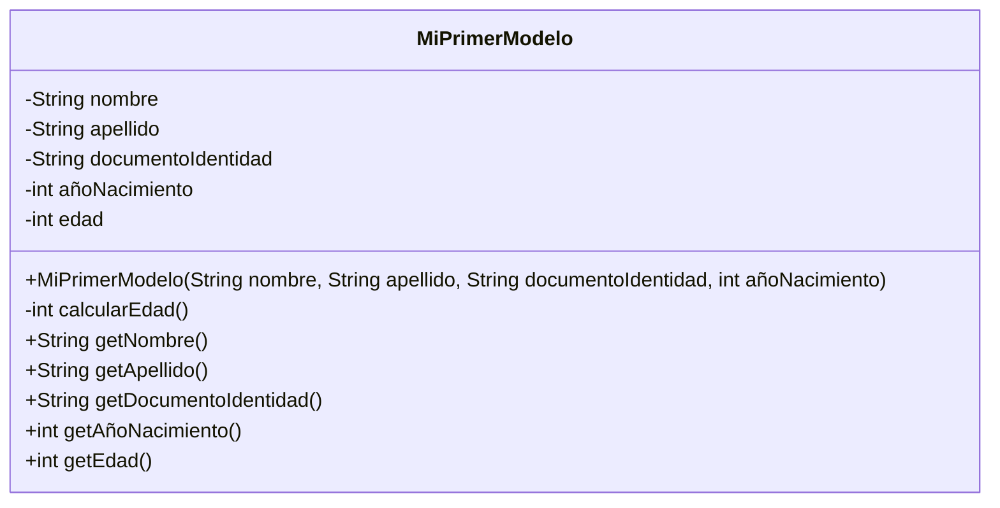

# mi-primer-modelo-simoneaa
simoneaa

## Introducción
Objetivo: Modelar el concepto de una persona. Una persona contiene:  

- Nombre.
- Apellido.
- Número de documento de identidad.
- Año de nacimiento.
- Edad (en función del año de nacimiento).

**Requisitos:**  

- Modelar la entidad con sus atributos, la clase debe tener un constructor que inicialice los valores de sus respectivos atributos.
- Realizar los tests pertinentes para alcanzar un coverage mínimo del 70%.

## Código

```Java
package org.miprimermodelo_simoneaa;

import java.time.Year;


public class MiPrimerModelo {
    
    private String nombre;
    private String apellido;
    private String documentoIdentidad;
    private int añoNacimiento;
    private int edad;
    
    public MiPrimerModelo(String nombre, String apellido, String documentoIdentidad, int añoNacimiento) {
    this.nombre = nombre;
    this.apellido = apellido;
    this.documentoIdentidad = documentoIdentidad;
    this.añoNacimiento = añoNacimiento;
    this.edad = calcularEdad();
    }
    
    private int calcularEdad() {
        int anioActual = Year.now().getValue();
        return anioActual - this.añoNacimiento;
    }
    
    public String getNombre() {
    return this.nombre;
    }
    public String getApellido() {
    return this.apellido;
    }
    public String getDocumentoIdentidad() {
    return this.documentoIdentidad;
    }
    public int getAñoNacimiento() {
    return this.añoNacimiento;
    }
    public int getEdad() {
    return this.edad;
    }
}
```

## Diagrama de clase  


    
## Testing
